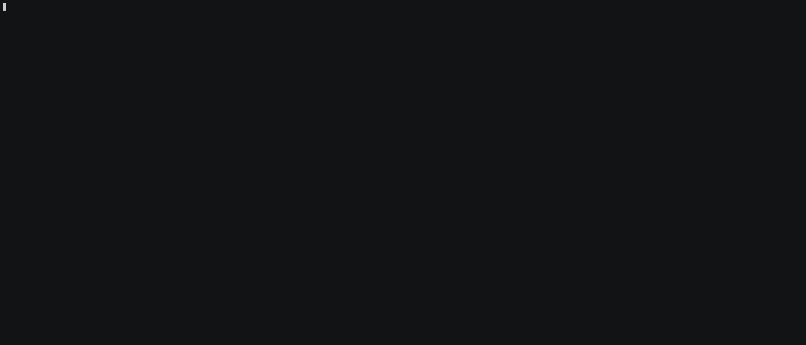

# GOT

GOT is a command-line tool designed to enhance your git workflow by integrating AI-driven commit message suggestions. It leverages models from both OpenAI and Groq to suggest relevant commit messages based on the changes you've made.

## Features

- **AI-Driven Commit Suggestions**: Utilize models like GPT-3.5, GPT-4, and various Groq models to generate commit messages.
- **Interactive Commit Process**: Choose commit messages from suggested options or enter manually.
- **Commit and Push**: Option to automatically add, commit, and push changes to a remote repository.



## Installation

Install from pip

```bash
pip install got-cli
```

## API Tokens

GOT leverages powerful AI models from OpenAI's [Chat GPT](https://platform.openai.com/docs/guides/text-generation) and [GROQ Cloud](https://console.groq.com/playground). To enable these features, you must configure API tokens as environment variables.

Before using the CLI, set up your environment variables based on the model you intend to use. These tokens will authenticate your requests to the respective services.

```
# Set the OpenAI Chat GPT API token
export CHAT_GPT_TOKEN=<Your_Chat_GPT_API_Token>

# Set the GROQ API key
export GROQ_API_KEY=<Your_GROQ_API_Key>
```

## Usage

### Committing Changes

To commit changes with AI-generated messages:

```bash
got commit -a -p
```

Options:

- `-a`: Automatically stage all changes before committing.
- `-p`: Push changes to the remote repository after committing.
- `-m`: Specify the language model to use for generating commit messages (Default: gpt-4-turbo).

Available models: `gpt-3.5-turbo, gpt-4-turbo, gemma-7b-it, llama2-70b-4096, llama3-70b-8192, llama3-8b-8192, mixtral-8x7b-32768`

### Modifying Prompts

To modify the prompts and examples used by the cli:

```bash
got prompt --set-example
```

Options:

- `--restore`: Restore the default prompts.
- `--set-example`: Set examples of the desired output.

## Contributing

Contributions are welcome! Feel free to submit pull requests or open issues to suggest improvements or add new features.

## License

This project is open source and available under the [MIT License](LICENSE).
